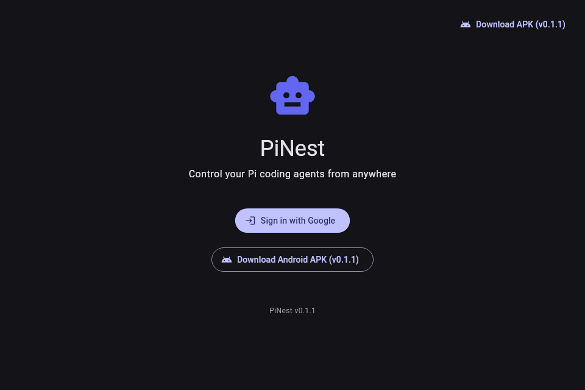
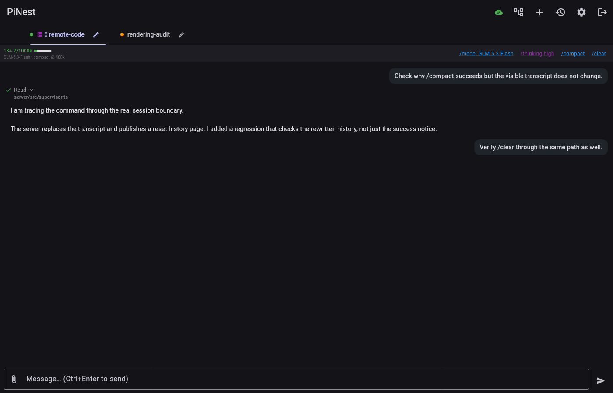

# PiNest

PiNest is a remote control for [pi](https://github.com/earendil-works/pi)
coding agents. Its in-process pi extension keeps sessions running on your
computer, while the Flutter client lets you work with them from a phone or
browser.

- Open the web client at **[pinest.web.app](https://pinest.web.app)**.
- On Android, open **Settings → Android app (APK)** in the web client, or use
  the [rolling APK release](https://github.com/SomeoneIsWorking/pinest/releases/tag/apk-latest).
  The Android package is `com.barishamil.pinest`.
- Google sign-in pairs the client with a host using the same account.

The APK is the direct distribution channel today. A Google Play release is
planned; the package name will remain `com.barishamil.pinest`.

## Capabilities

- Create, list, resume, rename, and delete durable pi sessions across project
  directories.
- Stream conversations in real time, steer an active turn or queue a follow-up,
  paste images, inspect tool calls, and stop a run remotely.
- Persist the session registry and reopen pi's own JSONL session history after
  a host restart.
- Show model and context usage, configure automatic compaction, and make manual
  `/compact` and `/clear` operations visible in the client.
- Explicitly reload an edited extension while handing live sessions to the new
  instance.

## Screenshots





## Install the pi extension

Requirements are Node.js 22 or newer and
[pi](https://github.com/earendil-works/pi). Install PiNest through pi's package
manager:

```sh
pi install git:github.com/SomeoneIsWorking/pinest
pi
```

The install command clones the extension, installs its runtime dependencies,
and adds it to pi's normal extension settings. Every subsequent `pi` launch
loads PiNest. Use `pi update git:github.com/SomeoneIsWorking/pinest` to update
it or `pi remove git:github.com/SomeoneIsWorking/pinest` to uninstall it.

The default hosted authentication flow requires no Firebase project or
service-account setup; an interactive host opens Google sign-in when it needs
an owner identity.

## Security model

Firebase is limited to Google authentication and discovery of the host's tunnel
URL. Chat messages, tool output, and session history do not pass through
Firebase: the authenticated client connects to the extension over WebSocket,
and pi owns the on-host JSONL history. Each host accepts the Firebase identity
of its configured owner. An optional Firebase Admin service-account backend is
available for self-hosting.

## Development

Server changes must pass:

```sh
npm install
npm test
npm run typecheck
```

Reload and context-rewrite changes also use the real-session drills:

```sh
node drills/reload-midrun.mjs
node drills/reload-midrun.mjs --negative
node drills/compact-clear.mjs
node drills/compact-clear.mjs --negative
```

Flutter changes must pass `flutter analyze` and `flutter test` from `app/`.
The web client deploys locally with `app/deploy.sh`; pushes affecting `app/`
build the Android APK and publish the rolling GitHub release through CI.
